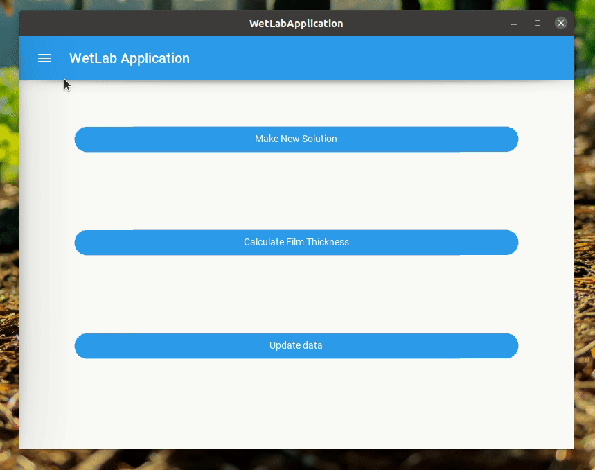
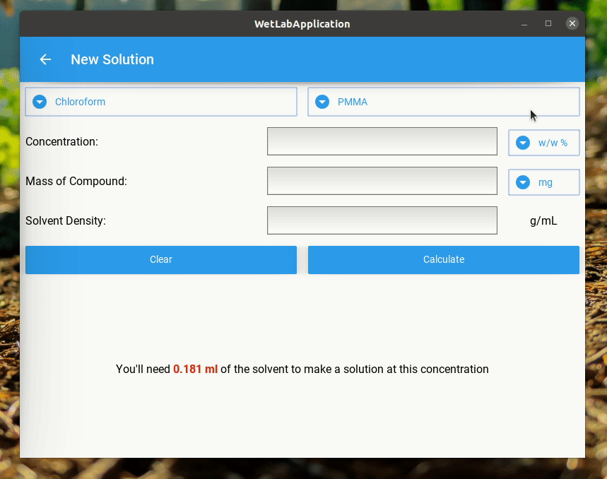
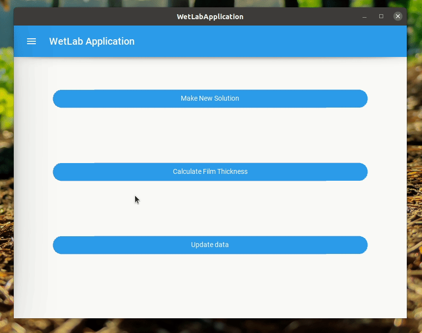

# WetLabApp

Application to assist in research & lab work!
Created with Python using the Kivy framework with Peewee ORM.

## Motivation

Solution calculators exist, but they typically require being able to control the mass of the solute. Since we weren't able to control that parameter, I created a GUI application that could give the volume needed for a solution knowing the desired concentration and mass of the solute. I realized I really liked programming quickly after, and started adding other features just to extend the project in my free time.

## Demo

#### Making a New Solution

#### Dynamic Data Fields

#### Create and Read

#### Update

#### Delete

## Technology Used

- Python
- Kivy framework
- Peewee ORM
- SQLite

## Features

- calculation of volume needed for making solutions of a certain concentration
- calculation of film thickness (approximation assuming uniform thickness, only accurate for dropcast films)
- CRUD capabilities with solvents and materials

## Installation

Coming soon!

